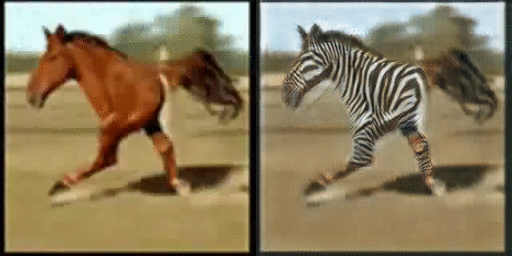

<br><br><br>

# CycleGAN
### [PyTorch](https://github.com/junyanz/pytorch-CycleGAN-and-pix2pix) | [project page](https://junyanz.github.io/CycleGAN/) |   [paper](https://arxiv.org/pdf/1703.10593.pdf)

Torch implementation for learning an image-to-image translation (i.e. [pix2pix](https://github.com/phillipi/pix2pix)) **without** input-output pairs, for example:

**New**:  Please check out [contrastive-unpaired-translation](https://github.com/taesungp/contrastive-unpaired-translation) (CUT), our new unpaired image-to-image translation model that enables fast and memory-efficient training.


[Unpaired Image-to-Image Translation using Cycle-Consistent Adversarial Networks](https://junyanz.github.io/CycleGAN/)  
 [Jun-Yan Zhu](https://people.eecs.berkeley.edu/~junyanz/)\*,  [Taesung Park](https://taesung.me/)\*, [Phillip Isola](http://web.mit.edu/phillipi/), [Alexei A. Efros](https://people.eecs.berkeley.edu/~efros/)  
 Berkeley AI Research Lab, UC Berkeley  
 In ICCV 2017. (* equal contributions)  

This package includes CycleGAN, [pix2pix](https://github.com/phillipi/pix2pix), as well as other methods like [BiGAN](https://arxiv.org/abs/1605.09782)/[ALI](https://ishmaelbelghazi.github.io/ALI/) and Apple's paper [S+U learning](https://arxiv.org/pdf/1612.07828.pdf).  
The code was written by [Jun-Yan Zhu](https://github.com/junyanz) and [Taesung Park](https://github.com/taesung).  
**Update**: Please check out [PyTorch](https://github.com/junyanz/pytorch-CycleGAN-and-pix2pix) implementation for CycleGAN and pix2pix.
The PyTorch version is under active development and can produce results comparable or better than this Torch version.

## Other implementations:
<p><a href="https://github.com/leehomyc/cyclegan-1"> [Tensorflow]</a> (by Harry Yang),
<a href="https://github.com/architrathore/CycleGAN/">[Tensorflow]</a> (by Archit Rathore),
<a href="https://github.com/vanhuyz/CycleGAN-TensorFlow">[Tensorflow]</a> (by Van Huy),
<a href="https://github.com/XHUJOY/CycleGAN-tensorflow">[Tensorflow]</a> (by Xiaowei Hu),
<a href="https://github.com/LynnHo/CycleGAN-Tensorflow-Simple"> [Tensorflow-simple]</a> (by Zhenliang He),
<a href="https://github.com/luoxier/CycleGAN_Tensorlayer"> [TensorLayer]</a> (by luoxier),
<a href="https://github.com/Aixile/chainer-cyclegan">[Chainer]</a> (by Yanghua Jin),
<a href="https://github.com/yunjey/mnist-svhn-transfer">[Minimal PyTorch]</a> (by yunjey),
<a href="https://github.com/Ldpe2G/DeepLearningForFun/tree/master/Mxnet-Scala/CycleGAN">[Mxnet]</a> (by Ldpe2G),
<a href="https://github.com/tjwei/GANotebooks">[lasagne/Keras]</a> (by tjwei),
<a href="https://github.com/simontomaskarlsson/CycleGAN-Keras">[Keras]</a> (by Simon Karlsson)</p>
</ul>

## Applications
### Monet Paintings to Photos


### Collection Style Transfer


### Object Transfiguration


### Season Transfer


### Photo Enhancement: Narrow depth of field


## Prerequisites
- Linux or OSX
- NVIDIA GPU + CUDA CuDNN (CPU mode and CUDA without CuDNN may work with minimal modification, but untested)
- For MAC users, you need the Linux/GNU commands `gfind` and `gwc`, which can be installed with `brew install findutils coreutils`.

## Getting Started
### Installation
- Install torch and dependencies from https://github.com/torch/distro
- Install torch packages `nngraph`, `class`, `display`
```bash
luarocks install nngraph
luarocks install class
luarocks install https://raw.githubusercontent.com/szym/display/master/display-scm-0.rockspec
```
- Clone this repo:
```bash
git clone https://github.com/junyanz/CycleGAN
cd CycleGAN
```

### Apply a Pre-trained Model
- Download the test photos (taken by [Alexei Efros](https://www.flickr.com/photos/aaefros)):
```
bash ./datasets/download_dataset.sh ae_photos
```
- Download the pre-trained model `style_cezanne` (For CPU model, use `style_cezanne_cpu`):
```
bash ./pretrained_models/download_model.sh style_cezanne
```
- Now, let's generate Paul Cézanne style images:
```
DATA_ROOT=./datasets/ae_photos name=style_cezanne_pretrained model=one_direction_test phase=test loadSize=256 fineSize=256 resize_or_crop="scale_width" th test.lua
```
The test results will be saved to `./results/style_cezanne_pretrained/latest_test/index.html`.  
Please refer to [Model Zoo](#model-zoo) for more pre-trained models.
`./examples/test_vangogh_style_on_ae_photos.sh` is an example script that downloads the pretrained Van Gogh style network and runs it on Efros's photos.

### Train
- Download a dataset (e.g. zebra and horse images from ImageNet):
```bash
bash ./datasets/download_dataset.sh horse2zebra
```
- Train a model:
```bash
DATA_ROOT=./datasets/horse2zebra name=horse2zebra_model th train.lua
```
- (CPU only) The same training command without using a GPU or CUDNN. Setting the environment variables ```gpu=0 cudnn=0``` forces CPU only
```bash
DATA_ROOT=./datasets/horse2zebra name=horse2zebra_model gpu=0 cudnn=0 th train.lua
```
- (Optionally) start the display server to view results as the model trains. (See [Display UI](#display-ui) for more details):
```bash
th -ldisplay.start 8000 0.0.0.0
```

### Test
- Finally, test the model:
```bash
DATA_ROOT=./datasets/horse2zebra name=horse2zebra_model phase=test th test.lua
```
The test results will be saved to an HTML file here: `./results/horse2zebra_model/latest_test/index.html`.


## Model Zoo
Download the pre-trained models with the following script. The model will be saved to `./checkpoints/model_name/latest_net_G.t7`.
```bash
bash ./pretrained_models/download_model.sh model_name
```
- `orange2apple` (orange -> apple) and `apple2orange`: trained on ImageNet categories `apple` and `orange`.
- `horse2zebra` (horse -> zebra) and `zebra2horse` (zebra -> horse): trained on ImageNet categories `horse` and `zebra`.
- `style_monet` (landscape photo -> Monet painting style),  `style_vangogh` (landscape photo  -> Van Gogh painting style), `style_ukiyoe` (landscape photo  -> Ukiyo-e painting style), `style_cezanne` (landscape photo  -> Cezanne painting style): trained on paintings and Flickr landscape photos.
- `monet2photo` (Monet paintings -> real landscape): trained on paintings and Flickr landscape photographs.
- `cityscapes_photo2label` (street scene -> label) and `cityscapes_label2photo` (label -> street scene): trained on the Cityscapes dataset.
- `map2sat` (map -> aerial photo) and `sat2map` (aerial photo -> map): trained on Google maps.
- `iphone2dslr_flower` (iPhone photos of flowers -> DSLR photos of flowers): trained on Flickr photos.

CPU models can be downloaded using:
```bash
bash pretrained_models/download_model.sh <name>_cpu
```
, where `<name>` can be `horse2zebra`, `style_monet`, etc. You just need to append `_cpu` to the target model.

## Training and Test Details
To train a model,  
```bash
DATA_ROOT=/path/to/data/ name=expt_name th train.lua
```
Models are saved to `./checkpoints/expt_name` (can be changed by passing `checkpoint_dir=your_dir` in train.lua).  
See `opt_train` in `options.lua` for additional training options.

To test the model,
```bash
DATA_ROOT=/path/to/data/ name=expt_name phase=test th test.lua
```
This will run the model named `expt_name` in both directions on all images in `/path/to/data/testA` and `/path/to/data/testB`.  
A webpage with result images will be saved to `./results/expt_name` (can be changed by passing `results_dir=your_dir` in test.lua).  
See `opt_test` in `options.lua` for additional test options. Please use `model=one_direction_test` if you only would like to generate outputs of the trained network in only one direction, and specify `which_direction=AtoB` or `which_direction=BtoA` to set the direction.

There are other options that can be used. For example, you can specify `resize_or_crop=crop` option to avoid resizing the image to squares. This is indeed how we trained GTA2Cityscapes model in the projet [webpage](https://junyanz.github.io/CycleGAN/) and [Cycada](https://arxiv.org/pdf/1711.03213.pdf) model. We prepared the images at 1024px resolution, and used `resize_or_crop=crop fineSize=360` to work with the cropped images of size 360x360. We also used `lambda_identity=1.0`.

## Datasets
Download the datasets using the following script. Many of the datasets were collected by other researchers. Please cite their papers if you use the data.
```bash
bash ./datasets/download_dataset.sh dataset_name
```
- `facades`: 400 images from the [CMP Facades dataset](http://cmp.felk.cvut.cz/~tylecr1/facade/). [[Citation](datasets/bibtex/facades.tex)]
- `cityscapes`: 2975 images from the [Cityscapes training set](https://www.cityscapes-dataset.com/). [[Citation](datasets/bibtex/cityscapes.tex)]. Note: Due to license issue, we do not host the dataset on our repo. Please download the dataset directly from the Cityscapes webpage. Please refer to `./datasets/prepare_cityscapes_dataset.py` for more detail.
- `maps`: 1096 training images scraped from Google Maps.
- `horse2zebra`: 939 horse images and 1177 zebra images downloaded from [ImageNet](http://www.image-net.org/) using the keywords `wild horse` and `zebra`
- `apple2orange`: 996 apple images and 1020 orange images downloaded from [ImageNet](http://www.image-net.org/) using the keywords `apple` and `navel orange`.
- `summer2winter_yosemite`: 1273 summer Yosemite images and 854 winter Yosemite images were downloaded using Flickr API. See more details in our paper.
- `monet2photo`, `vangogh2photo`, `ukiyoe2photo`, `cezanne2photo`: The art images were downloaded from [Wikiart](https://www.wikiart.org/). The real photos are downloaded from Flickr using the combination of the tags *landscape* and *landscapephotography*. The training set size of each class is Monet:1074, Cezanne:584, Van Gogh:401, Ukiyo-e:1433, Photographs:6853.
- `iphone2dslr_flower`: both classes of images were downloaded from Flickr. The training set size of each class is iPhone:1813, DSLR:3316. See more details in our paper.


## Display UI
Optionally, for displaying images during training and test, use the [display package](https://github.com/szym/display).

- Install it with: `luarocks install https://raw.githubusercontent.com/szym/display/master/display-scm-0.rockspec`
- Then start the server with: `th -ldisplay.start`
- Open this URL in your browser: [http://localhost:8000](http://localhost:8000)

By default, the server listens on localhost. Pass `0.0.0.0` to allow external connections on any interface:
```bash
th -ldisplay.start 8000 0.0.0.0
```
Then open `http://(hostname):(port)/` in your browser to load the remote desktop.

## Setup Training and Test data
To train CycleGAN model on your own datasets, you need to create a data folder with two subdirectories `trainA` and `trainB` that contain images from domain A and B. You can test your model on your training set by setting ``phase='train'`` in  `test.lua`. You can also create subdirectories `testA` and `testB` if you have test data.

You should **not** expect our method to work on just any random combination of input and output datasets (e.g. `cats<->keyboards`). From our experiments, we find it works better if two datasets share similar visual content. For example, `landscape painting<->landscape photographs` works much better than `portrait painting <-> landscape photographs`. `zebras<->horses` achieves compelling results while `cats<->dogs` completely fails.  See the following section for more discussion.


## Failure cases


Our model does not work well when the test image is rather different from the images on which the model is trained, as is the case in the figure to the left (we trained on horses and zebras without riders, but test here one a horse with a rider).  See additional typical failure cases [here](https://junyanz.github.io/CycleGAN/images/failures.jpg). On translation tasks that involve color and texture changes, like many of those reported above, the method often succeeds. We have also explored tasks that require geometric changes, with little success. For example, on the task of `dog<->cat` transfiguration, the learned translation degenerates into making minimal changes to the input. We also observe a lingering gap between the results achievable with paired training data and those achieved by our unpaired method. In some cases, this gap may be very hard -- or even impossible,-- to close: for example, our method sometimes permutes the labels for tree and building in the output of the cityscapes photos->labels task.


## Citation
If you use this code for your research, please cite our [paper](https://junyanz.github.io/CycleGAN/):

```
@inproceedings{CycleGAN2017,
  title={Unpaired Image-to-Image Translation using Cycle-Consistent Adversarial Networkss},
  author={Zhu, Jun-Yan and Park, Taesung and Isola, Phillip and Efros, Alexei A},
  booktitle={Computer Vision (ICCV), 2017 IEEE International Conference on},
  year={2017}
}

```


## Related Projects:
**[contrastive-unpaired-translation](https://github.com/taesungp/contrastive-unpaired-translation) (CUT)**<br>
**[pix2pix-Torch](https://github.com/phillipi/pix2pix) | [pix2pixHD](https://github.com/NVIDIA/pix2pixHD) |
[BicycleGAN](https://github.com/junyanz/BicycleGAN) | [vid2vid](https://tcwang0509.github.io/vid2vid/) | [SPADE/GauGAN](https://github.com/NVlabs/SPADE)**<br>
**[iGAN](https://github.com/junyanz/iGAN) | [GAN Dissection](https://github.com/CSAILVision/GANDissect) | [GAN Paint](http://ganpaint.io/)**

## Cat Paper Collection
If you love cats, and love reading cool graphics, vision, and ML papers, please check out the Cat Paper [Collection](https://github.com/junyanz/CatPapers).  


## Acknowledgments
Code borrows from [pix2pix](https://github.com/phillipi/pix2pix) and [DCGAN](https://github.com/soumith/dcgan.torch). The data loader is modified from [DCGAN](https://github.com/soumith/dcgan.torch) and  [Context-Encoder](https://github.com/pathak22/context-encoder). The generative network is adopted from [neural-style](https://github.com/jcjohnson/neural-style) with [Instance Normalization](https://github.com/DmitryUlyanov/texture_nets/blob/master/InstanceNormalization.lua).
