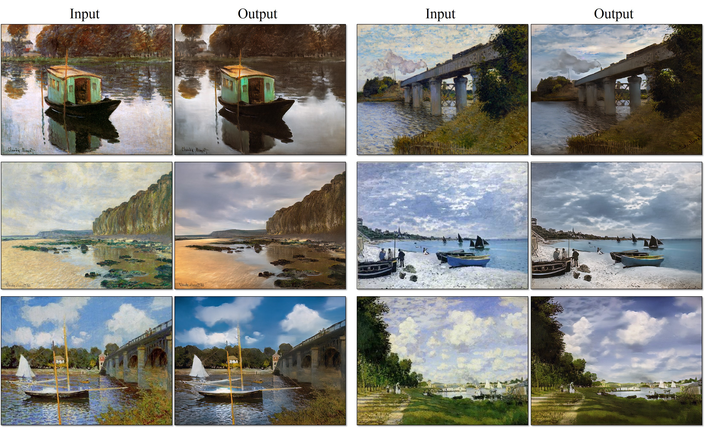
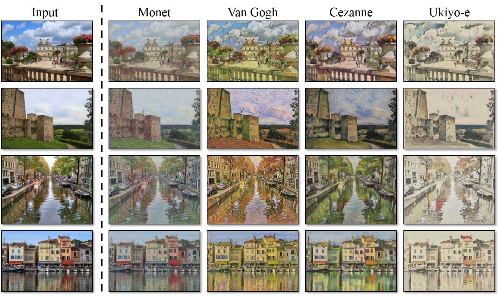
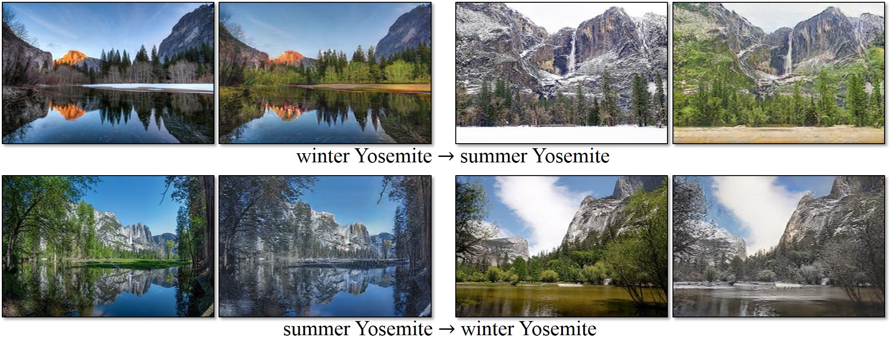
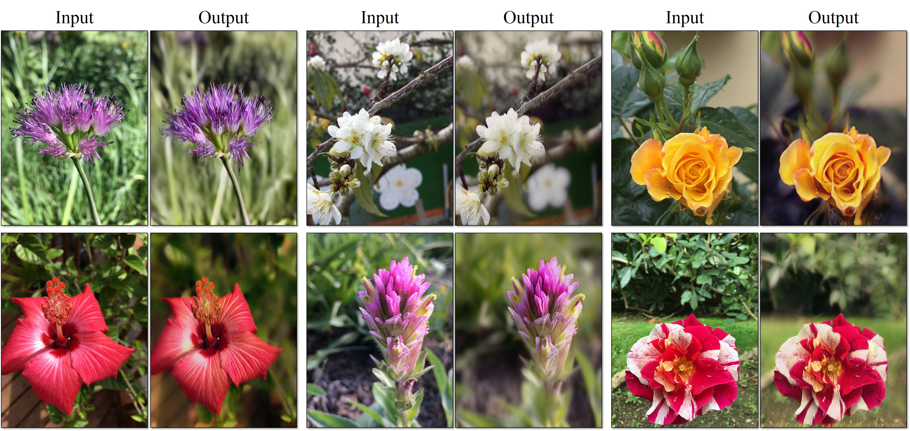

# CycleGAN
### [[project page]](https://junyanz.github.io/CycleGAN/)   [[paper]](https://arxiv.org/pdf/1703.10593.pdf)


Torch implementation for learning an image-to-image translation (i.e. **pix2pix**) without input-output pairs, for example:


[Unpaired Image-to-Image Translation using Cycle-Consistent Adversarial Networks](https://junyanz.github.io/CycleGAN/)  
 [Jun-Yan Zhu](https://people.eecs.berkeley.edu/~junyanz/)\*,  [Taesung Park](https://taesung.me/)\*, [Phillip Isola](http://web.mit.edu/phillipi/), [Alexei A. Efros](https://people.eecs.berkeley.edu/~efros/)  
 Berkeley AI Research Lab, UC Berkeley  
 In arxiv, 2017. (* equal contributions)  

This package includes CycleGAN, [pix2pix](https://github.com/phillipi/pix2pix), as well as other methods like [BiGAN](https://arxiv.org/abs/1605.09782)/[ALI](https://ishmaelbelghazi.github.io/ALI/) and Apple's paper [S+U learning](https://arxiv.org/pdf/1612.07828.pdf).  
**PyTorch** version is coming soon (by April 7th).

## Applications
### Monet Paintings to Photos


### Collection Style Transfer


### Object Transfiguration


### Season Transfer


### Photo Enhancement: iPhone photo to DSLR photo


## Setup

### Prerequisites
- Linux or OSX
- NVIDIA GPU + CUDA CuDNN (CPU mode and CUDA without CuDNN may work with minimal modification, but untested)

### Getting Started
- Install torch and dependencies from https://github.com/torch/distro
- Install torch packages `nngraph`, `class`, `display`
```bash
luarocks install nngraph
luarocks install class
luarocks install https://raw.githubusercontent.com/szym/display/master/display-scm-0.rockspec
```
- Clone this repo:
```bash
git clone https://github.com/junyanz/CycleGAN
cd CycleGAN
```
- Download the dataset (e.g. zebra and horse images from ImageNet):
```bash
bash ./datasets/download_dataset.sh horse2zebra
```
- Train the model
```bash
DATA_ROOT=./datasets/horse2zebra name=horse2zebra_model th train.lua
```
- (CPU only) The same training command without using a GPU or CUDNN. Setting the environment variables ```gpu=0 cudnn=0``` forces CPU only
```bash
DATA_ROOT=./datasets/horse2zebra name=horse2zebra_model gpu=0 cudnn=0 th train.lua
```
- (Optionally) start the display server to view results as the model trains. (See [Display UI](#display-ui) for more details):
```bash
th -ldisplay.start 8000 0.0.0.0
```

- Finally, test the model:
```bash
DATA_ROOT=./datasets/horse2zebra name=horse2zebra_model phase=test th test.lua
```
The test results will be saved to a html file here: `./results/horse2zebra_model/latest_test/index.html`.

## Train
```bash
DATA_ROOT=/path/to/data/ name=expt_name th train.lua
```

Models are saved to `./checkpoints/expt_name` (can be changed by passing `checkpoint_dir=your_dir` in train.lua).

See `opt_train` in `options.lua` for additional training options.

## Test
```bash
DATA_ROOT=/path/to/data/ name=expt_name which_direction='AtoB' phase=test th test.lua
```

This will run the model named `expt_name` in both directions on all images in `/path/to/data/testA` and `/path/to/data/testB`.
If `which_direction` is 'BtoA', the two sets A and B of the datasets are flipped.

Result images, and a webpage to view them, are saved to `./results/expt_name` (can be changed by passing `results_dir=your_dir` in test.lua).

See `opt_test` in `options.lua` for additional testing options.


## Datasets
Download the datasets using the following script:
```bash
bash ./datasets/download_dataset.sh dataset_name
```

- `cityscapes`: 2975 images from the [Cityscapes training set](https://www.cityscapes-dataset.com/).
- `maps`: 1096 training images scraped from Google Maps.
- `horse2zebra`: 939 horse images and 1177 zebra images downloaded from [ImageNet](http://www.image-net.org/) using keywords `wild horse` and `zebra`
- `apple2orange`: 996 apple images and 1020 orange images downloaded from [ImageNet](http://www.image-net.org/) using keywords `apple` and `navel orange`.
- `summer2winter_yosemite`: 1273 summer Yosemite images and 854 winter Yosemite images were downloaded using Flickr API. See more details in our paper.
- `monet2photo`, `vangogh2photo`, `ukiyoe2photo`, `cezanne2photo`: The art images were downloaded from [Wikiart](https://www.wikiart.org/). The real photos are downloaded from Flickr using combination of tags *landscape* and *landscapephotography*. The training set size of each class is Monet:1074, Cezanne:584, Van Gogh:401, Ukiyo-e:1433, Photographs:6853.
- `iphone2dslr_flower`: both classe of images were downlaoded from Flickr. The training set size of each class is iPhone:1813, DSLR:3316. See more details in our paper.

## Pre-trained Models
Download the pre-trained models with the following script. You need to rename the model (e.g. `orange2apple` to `/checkpoints/orange2apple/latest_net_G.t7`) after the download has finished.
```bash
bash ./models/download_model.sh model_name
```
- `orange2apple` (orange -> apple) and `apple2orange`: trained on the CMP Facades dataset.
- `horse2zebra` (horse -> zebra) and `zebra2horse` (zebra -> horse): trained on the CMP Facades dataset.
- `style_monet` (landscape photo -> Monet painting style),  `style_vangogh` (landscape photo  -> Van Gogh painting style), `style_ukiyoe` (landscape photo  -> Ukiyo-e painting style), `style_cezanne` (landscape photo  -> Cezanne painting style): trained on paintings and Flickr landscape photos.
- `monet2photo` (Monet paintings -> real landscape): trained on paintings and Flickr landscape photos.
- `cityscapes_photo2label` (street scene -> label) and `cityscapes_label2photo` (label -> street scene): trained on the Cityscapes dataset.
- `map2sat` (map -> aerial photo) and `sat2map` (aerial photo -> map): trained on Google maps.
- `iphone2dslr_flower` (iPhone photos of flower -> DSLR photos of flower): trained on Flickr photos.

For example, to generate Ukiyo-e style images using the pre-trained model,

```
bash ./datasets/download_dataset.ukiyoe2photo
bash ./models/download_model.sh style_ukiyoe
mkdir ./checkpoints/ukiyoe2photo_pretrained
mv ./models/style_ukiyoe.t7 ./checkpoints/ukiyoe2photo_pretrained/latest_net_G.t7
DATA_ROOT=./datasets/ukiyoe2photo name=ukiyoe2photo_pretrained which_direction='BtoA' model=one_direction_test phase=test th test.lua
```

Please pay attention to the direction. `which_direction='BtoA'` was used because the pretrained network transforms photos to Ukiyo-e-style images, but the dataset `ukiyoe2photo` is from Ukiyo-e paintings to photos. `model=one_direction_test` loads the code that generates outputs of the trained network in only one direction.

## Display UI
Optionally, for displaying images during training and test, use the [display package](https://github.com/szym/display).

- Install it with: `luarocks install https://raw.githubusercontent.com/szym/display/master/display-scm-0.rockspec`
- Then start the server with: `th -ldisplay.start`
- Open this URL in your browser: [http://localhost:8000](http://localhost:8000)

By default, the server listens on localhost. Pass `0.0.0.0` to allow external connections on any interface:
```bash
th -ldisplay.start 8000 0.0.0.0
```
Then open `http://(hostname):(port)/` in your browser to load the remote desktop.


## Citation
If you use this code for your research, please cite our [paper](https://junyanz.github.io/CycleGAN/):

```
@article{CycleGAN2017,
  title={Unpaired Image-to-Image Translation using Cycle-Consistent Adversarial Networkss},
  author={Zhu, Jun-Yan and Park, Taesung and Isola, Phillip and Efros, Alexei A},
  journal={arXiv preprint arXiv:1703.10593},
  year={2017}
}
```


## Related Projects:
[pix2pix](https://github.com/phillipi/pix2pix): Image-to-image translation using conditional adversarial nets  
[iGAN](https://github.com/junyanz/iGAN): Interactive Image Generation via Generative Adversarial Networks

## Cat Paper Collection
If you love cats, and love reading cool graphics, vision, and learning papers, please check out the Cat Paper Collection:  
[[Github]](https://github.com/junyanz/CatPapers) [[Webpage]](http://people.eecs.berkeley.edu/~junyanz/cat/cat_papers.html)

## Acknowledgments
Code borrows from [pix2pix](https://github.com/phillipi/pix2pix) and [DCGAN](https://github.com/soumith/dcgan.torch). The data loader is modified from [DCGAN](https://github.com/soumith/dcgan.torch) and  [Context-Encoder](https://github.com/pathak22/context-encoder). The generative network is adopted from [neural-style](https://github.com/jcjohnson/neural-style) with [Instance Normalization](https://github.com/DmitryUlyanov/texture_nets/blob/master/InstanceNormalization.lua).
